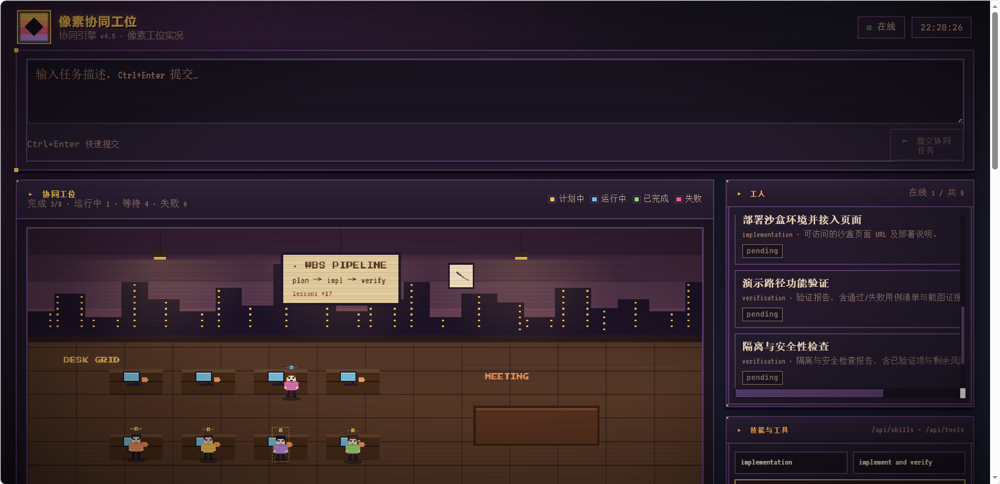

# Hermes Collab Engine v4.5

多 Agent 协同引擎：Leader 拆解任务，Worker 并行执行，面板实时可视化。



## 快速开始

```bash
# 克隆
git clone https://github.com/lpc0387/hermes-collab-engine.git
cd hermes-collab-engine
pip install -e .

# 启动
opc
```

启动后选择配置方式 → 选模型 → 面板自动运行。

## 沙盒演示

仓库内置一套与生产隔离的沙盒，使用脱敏 SQLite + Mock API，**不调用真实 worker、不写生产数据**，适合在本地或演示机上快速展示页面。

```bash
# 一键启动（默认运行 2 小时，超时自动停止）
./scripts/start_sandbox.sh

# 自定义运行小时数
./scripts/start_sandbox.sh 4              # 4 小时
./scripts/start_sandbox.sh 0.5            # 30 分钟
./scripts/start_sandbox.sh --hours 8      # 8 小时
./scripts/start_sandbox.sh --port 8877    # 换端口
./scripts/start_sandbox.sh -i             # 交互式询问时长

# 复用已有数据库，不重新播种
./scripts/start_sandbox.sh --no-reseed
```

启动后访问：`http://127.0.0.1:8876/`

详见：[`sandbox/README.md`](sandbox/README.md)

## Leader 总结日记本

任何任务跑完（completed/failed）后，仪表盘会自动弹出一个**像素本子**形式的日记本，把 Leader 的最终聚合反馈完整打印出来：

- 完成时自动弹出（同一会话不重复弹）
- 历史记录表格里点 📓 按钮可重新打开任意 run 的总结
- 内置滚动条，长篇报告也能完整阅读
- 一键复制 / 下载为 Markdown
- 按 ESC 或点击空白处关闭

## 核心概念

```
用户 → Leader(AI) → WBS 拆解 → Worker(AI) × N 并行 → 聚合 → 结果
```

- **Leader** 负责复杂度评分、WBS 拆解、结果聚合、Skill/Tool 分发
- **Worker** 执行具体节点，按需加载 Skill 和工具白名单
- **Agent Backend** 抽象不同编码 Agent（Claude Code / Codex / OpenCode）
- **SQLite** 持久化运行状态、节点结果、上下文快照和经验
- **面板** 实时可视化流水线、Worker 池、Skill/Tool 注入

## v4.5 新特性

| 特性 | 说明 |
|---|---|
| Skill 分发 | Leader 根据节点能力自动选择技能注入 Worker prompt，top-3 限制 |
| MCP 工具管理 | Leader 按节点类型分配工具白名单，含 MCP 只读工具，最小权限 |
| 可视化面板 | 流水线视图 + Worker 池卡片 + Skill/Tool badge，深色主题 |

## 全部能力

| 能力 | 说明 |
|---|---|
| 复杂度判断 | 按领域、步骤数、模糊度、耦合度、风险评分 |
| WBS 拆解 | 自动拆成可执行的工作分解节点 |
| Agent Backend | Claude Code / Codex / OpenCode / 自定义 |
| Skill 分发 | 按节点能力选择技能注入 prompt |
| MCP 工具管理 | 工具白名单 + MCP 只读 + fallback |
| 并行分发 | 依赖满足即派发，流式调度 |
| 超时守护 + 分片重试 | 超时拆为范围/证据/实现/风险分片 |
| 结果聚合 | 诚实报告成功、失败和超时 |
| 双轨输出 | 机器可解析 JSON + 人类可读交付物 |
| 上下文快照 | 压缩前自动保存，支持恢复 |
| 自学习经验 | 带作用域的 lessons（global/project/run/node） |
| 父代干预 | CLI 可 kill/split/skip 运行中节点 |
| 可视化面板 | Pipeline + Worker 池 + Skill/Tool badge |
| 环境变量模型 | `HERMES_COLLAB_MODEL` / `ANTHROPIC_MODEL` 回退 |

## 配置来源

启动器按以下优先级自动检测 API 配置：

1. **`~/.hermes/.env`** — `ANTHROPIC_API_KEY` + `ANTHROPIC_BASE_URL`（推荐）
2. **`~/.hermes/config.yaml`** — `model.base_url` + `model.default`
3. **`~/.hermes/auth.json`** — credential pool 中的 anthropic 凭据
4. **`~/.claude/settings.json`** — Claude Code 配置（fallback）
5. **手动输入** — BaseURL + API Key + 模型列表

Hermes 是 Leader，其配置应为主来源。Claude Code 配置仅作兼容回退。

## 模型选择

启动时分别选择：

- **Leader 模型**：复杂度判断、WBS 拆解、结果聚合、Hermes CLI 默认模型
- **Worker 模型**：节点执行、分片重试

## CLI 命令

### 运行任务

```bash
hermes-collab run "分析当前项目结构" --cwd . --json
hermes-collab run --request-file request.md --cwd .
hermes-collab run "实现协同任务" --agent claude-code --concurrency 4 --timeout 900
```

### 启动面板

```bash
hermes-collab server --host 0.0.0.0 --port 8765 --cwd .
```

### 查看 Skill / Tool

```bash
hermes-collab skills                                # 全部技能
hermes-collab skills --node-type implementation      # 预览选中技能
hermes-collab tools                                 # 全部工具配置
hermes-collab tools --node-type implementation       # 预览选中工具
```

### 查看 Agent / 状态

```bash
hermes-collab agents                # 已注册 backend
hermes-collab agents --available    # PATH 上可用的
hermes-collab status --json
```

### 经验管理

```bash
hermes-collab lessons                       # 列出经验
hermes-collab lessons --scope global        # 按作用域筛选
hermes-collab add-lesson --category timeout --lesson "拆分大文件" --scope global
```

### 运行中干预

```bash
hermes-collab kill-node <run_id> <node_id>  # 终止节点
hermes-collab split-node <run_id> <node_id> # 拆分节点
hermes-collab skip-node <run_id> <node_id>  # 跳过节点
hermes-collab redo-node <run_id> <node_id>  # 重做节点
hermes-collab log <run_id> <node_id> "msg"  # 写入日志
```

### 验证

```bash
hermes-collab verify-v45    # v4.5 功能完整性检查
```

## API

| 方法 | 路径 | 说明 |
|---|---|---|
| GET | `/api/overview` | 总览数据 |
| GET | `/api/runs` | 运行记录 |
| GET | `/api/runs/:id` | 运行详情（含节点、Worker、日志） |
| GET | `/api/logs` | 最近日志 |
| GET | `/api/lessons` | 自学习经验 |
| GET | `/api/agents` | 可用 Agent Backend |
| GET | `/api/skills?node_type=&task=` | Skill 注册表（可预览选择） |
| GET | `/api/tools?node_type=&task=` | Tool 配置（可预览选择） |
| GET | `/api/events` | SSE 实时事件流 |
| POST | `/api/runs` | 异步提交任务 |

## 持久化

SQLite 文件（默认 `data/collab.sqlite3`）存储：

- `runs` — 运行记录（含 agent 字段）
- `wbs_nodes` — 节点（含 skills_json, tools_json）
- `workers` — 执行器状态
- `logs` — 审计日志
- `lessons` — 经验（含 scope）
- `node_results` — 结构化结果
- `settings` — 引擎配置
- `context_snapshots` — 上下文快照

## 超时拆分策略

1. Worker 超时 → 自动拆分为 scope / evidence / implementation / risk 分片
2. 分片独立执行，结果聚合回父节点
3. 主动拆分：预计超时/高风险节点可在执行前拆分
4. `redo-node` 可对已完成节点重做，`--cascade` 级联下游

## Agent Backend

| Backend | 命令 | 输出解析 |
|---|---|---|
| claude-code | `claude -p` | session ID + text |
| codex | `codex` | JSON |
| opencode | `opencode` | text |

自定义 Backend：实现 `AgentBackend` 接口（`name`, `build_command`, `parse_output`, `default_allowed_tools`）并注册。

## 与 Hermes 集成

```bash
# Hermes 直接调用
hermes-collab run "任务描述" --cwd /path/to/project --json

# 启动器模式
opc  # 选配置 → 选模型 → 面板 + Hermes CLI
```

环境变量：

```bash
HERMES_COLLAB_MODEL=glm-5.1           # 全局模型
HERMES_COLLAB_LEADER_MODEL=glm-5.1    # Leader 模型
HERMES_COLLAB_WORKER_MODEL=kimi-k2.6  # Worker 模型
ANTHROPIC_MODEL=glm-5.1               # 回退
```

## 安全边界

- Worker 在独立子进程执行，受 `allowed_tools` 白名单约束
- API Key 仅存于环境变量和 `~/.hermes/.env`，不写入数据库
- `git push` 受 `git-write` tool profile 限制，仅 implementation 节点可用
- MCP 工具默认只读（`mcp-readonly` profile）

## 开发

```bash
pip install -e .
PYTHONPATH=src python3 -m unittest discover -s tests -v
```

```
src/hermes_collab_engine/
├── cli.py           # CLI 入口
├── engine.py        # 核心引擎
├── server.py        # Web 面板
├── store.py         # SQLite 持久化
├── models.py        # 数据模型
├── skills.py        # Skill 分发
├── tools.py         # MCP 工具管理
├── agents/          # Agent Backend 抽象
├── verification.py  # v4.5 完整性检查
└── ...
web/
└── index.html       # 可视化面板
```

## 许可证

MIT
